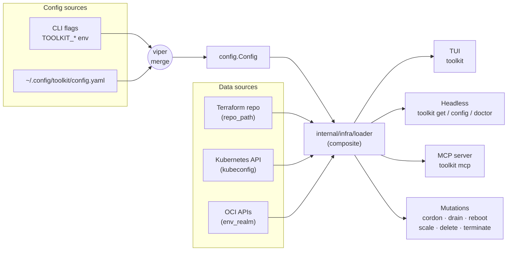

# Toolkit

[](https://github.com/jingle2008/toolkit/actions/workflows/ci.yml)
[](https://goreportcard.com/report/github.com/jingle2008/toolkit)
[](https://pkg.go.dev/github.com/jingle2008/toolkit)
[](https://codecov.io/gh/jingle2008/toolkit)

Toolkit is a collection of reusable Go components exposed through a modular CLI and optional TUI (built with [Bubble Tea](https://github.com/charmbracelet/bubbletea)).  
It targets day-to-day DevOps & development automation: querying Kubernetes, parsing Terraform plans, mass-editing config files, and inspecting large data tables directly in your terminal.

- [User Manual](docs/USER_MANUAL.md)
- [Kubernetes Client Fakes & Testing Patterns](docs/guide/k8s-fake-patterns.md)

---

## Feature Highlights

| Area           | Packages                        | Notes |
| -------------- | ------------------------------- | ----- |
| **CLI core**   | `internal/cli`                  | Cobra-based, flags auto-generated |
| **Interactive TUI** | `internal/ui/tui`             | Sort/search/filter large tabular datasets |
| **Infrastructure loaders** | `internal/infra/k8s`, `internal/infra/terraform` | Uniform abstraction for K8s & TF |
| **Config loading & validation** | `internal/config`, `internal/configloader` | JSON / YAML with defaulting & schema checks |
| **Collections helpers** | `internal/collections` | Generic filter/sort with predicates |
| **Encoding helpers** | `internal/encoding/jsonutil` | Fast JSON pointer traversal |
| **Error & logging** | `pkg/infra/logging` | Typed errors via std errors; zap logger |

## Architecture at a glance



The loader composite is the single funnel every entry point goes through, so the four surfaces (TUI, headless `get`, MCP, mutations) all see identical data and the same partial-load semantics.

---

## Install

```bash
# Latest release
go install github.com/jingle2008/toolkit/cmd/toolkit@latest

# From source
git clone https://github.com/jingle2008/toolkit.git
cd toolkit && make
```

```zsh
# From Homebrew (macOS/Linux)
brew install jingle2008/tap/toolkit
```

> **Already on the old `jingle2008/homebrew-toolkit` tap?** It's archived as of v0.3.x and won't receive new releases. Migrate with:
> ```zsh
> brew untap jingle2008/homebrew-toolkit
> brew uninstall toolkit
> brew install jingle2008/tap/toolkit
> ```

---

## Getting Started

After installation, try these quick commands:

```sh
toolkit init
# Scaffold an example config file at ~/.config/toolkit/config.yaml

toolkit config --validate
# Sanity-check the effective config; exits non-zero on failure

toolkit completion bash   # or zsh/fish
# Output shell completion script for your shell

toolkit version --check
# Print your installed version and check for updates
```

---

## Usage

```bash
toolkit --help                # all global flags
```

### Global Flags

| Flag | Default | Description |
| ---- | ------- | ----------- |
| `--config` | `~/.config/toolkit/config.yaml` | Path to config file (YAML or JSON) |
| `--repo_path` |  | Path to the repository |
| `--env_type` |  | Environment type (e.g. dev, prod) |
| `--env_region` |  | Environment region |
| `--env_realm` |  | Environment realm |
| `--category, -c` |  | Category to display |
| `--filter, -f` |  | Initial filter for current category |
| `--metadata_file` | `~/.config/toolkit/metadata.yaml` | Optional additional metadata file |
| `--kubeconfig` | `~/.kube/config` | Path to kubeconfig file |
| `--log_file` | `toolkit.log` | Path to log file |
| `--debug` | `false` | Enable debug logging |
| `--log_format` | `console` | Log format: `console`, `json`, or `slog` |
| `--log_level` | | Minimum log level: `debug`, `info`, `warn`, `error` (empty uses `--debug` flag) |
| `--mutation_env_override_allowed` | `false` | Allow MCP mutation tools to override the startup env per call (off by default for safety) |

*(See `internal/cli/flags.go` for the authoritative list.)*

### Headless `get` (for scripts and LLM integration)

`toolkit get <category>` is the non-TUI equivalent of selecting a category in the interactive UI. It uses the same loaders and emits machine-friendly output for piping into `jq`, posting to LLM tools, feeding spreadsheets, or driving shell pipelines.

Supported formats (`-o`): `table` (default), `json`, `jsonl`, `yaml`, `csv`, `tsv`.

```bash
# JSON array (default pretty-printed)
toolkit get tenant -o json

# Line-delimited JSON (great for streaming / `xargs`)
toolkit get gpunode -f us-ashburn-1 -o jsonl

# Plain table (default)
toolkit get dac

# YAML
toolkit get basemodel -f cohere -o yaml

# CSV for spreadsheets (proper quoting via encoding/csv)
toolkit get tenant -o csv > tenants.csv

# TSV for `cut` / `awk` pipelines
toolkit get gpupool -o tsv | cut -f1,3

# Suppress headers (table/csv/tsv)
toolkit get tenant --no-headers
```

Category aliases match the TUI (`t`, `bm`, `gn`, `dac`, …). Run `toolkit get alias` for the full list, or enable shell completion (`toolkit completion zsh`) for tab-completion. Logs are written to `--log_file` (default `toolkit.log`) so stdout stays clean for parsing.

For `gpunode`, `dac`, `modelartifact`, and the tenancy-override categories, the structured outputs (`json`, `jsonl`, `yaml`) are a flat array of objects with the originating group key injected as `pool`, `tenant`, or `model` — easier for `jq` and LLM consumers than the previous map-shaped output.

### Inspect effective config (`toolkit config`)

`toolkit config` prints the merged view every other subcommand sees — defaults + `TOOLKIT_*` env + config file + flags — so you can see what's actually in effect without opening the YAML by hand:

```bash
toolkit config                    # YAML (default)
toolkit config -o json            # JSON for `jq`
toolkit config --pretty=false     # compact JSON
toolkit config --validate         # run config.Validate(); exit non-zero on failure
```

`--validate` mode emits a structured `{valid, config_file, error?}` payload and exits non-zero on failure — suitable for `if ! toolkit config --validate; then abort; fi` precondition checks in CI/scripts.

### Cluster mutations

Maintenance operations the TUI exposes via keyboard shortcuts are also available as scriptable subcommands. All mutations support `--dry-run` (preview the action) and `--yes` / `-y` (skip the interactive prompt). Each call writes a JSON line to the audit log.

| Command | Effect |
| ------- | ------ |
| `toolkit cordon <node>` / `toolkit uncordon <node>` | Toggle scheduling on a Kubernetes node |
| `toolkit drain <node>` | Evict pods and cordon |
| `toolkit reboot <node>` | Reboot the underlying instance |
| `toolkit scale gpupool <name>` | Sync OCI instance-pool size to the Terraform-declared `pool.Size` (no `--size` flag — Terraform is the source of truth) |
| `toolkit delete dac <name>` | Delete a dedicated AI cluster (destructive — requires `--yes`) |
| `toolkit terminate <node>` | Terminate the underlying OCI instance (destructive — requires `--yes`) |

Example:

```bash
toolkit drain node-42 --dry-run     # preview
toolkit drain node-42 -y            # run without prompt
```

See [docs/recipes.md](docs/recipes.md) for end-to-end flows (MCP setup, maintenance windows, audit exports, Slack digests).

### MCP server (`toolkit mcp`)

For agent integration via the [Model Context Protocol](https://modelcontextprotocol.io), `toolkit mcp` boots a stdio MCP server that exposes the same loader surface as `get` — but as typed tools an AI agent can call directly, no shell-out needed.

Configure once in your MCP client. Claude Desktop / Claude Code use JSON:

```jsonc
{
  "mcpServers": {
    "toolkit": {
      "command": "toolkit",
      "args": ["mcp"]
    }
  }
}
```

Codex CLI (`~/.codex/config.toml`) uses TOML:

```toml
[mcp_servers.toolkit]
command = "toolkit"
args = ["mcp"]
```

See [docs/recipes.md](docs/recipes.md) for the per-client file paths and first prompts to try.

**Read tools** — return a `{ "items": [...], "count": N, "warnings": [...] }` envelope:

| Tool | Description |
| ---- | ----------- |
| `list_tenants` | Tenants in the configured realm |
| `list_base_models` | Base models from the cluster |
| `list_gpu_pools` | GPU pools (partial-load warnings surfaced) |
| `list_gpu_nodes` | GPU nodes (flat, with `pool` field) |
| `list_dacs` | Dedicated AI clusters (flat, with `tenant` field) |
| `list_environments` | All known toolkit environments |
| `list_service_tenancies` | Service tenancies from the repo |
| `list_model_artifacts` | Model artifacts (flat, with `model` field) |
| `list_definitions` | `kind`: `limit` / `console_property` / `property` |
| `list_tenancy_overrides` | Same `kind` enum, tenancy-scoped |
| `list_regional_overrides` | Same `kind` enum, region-scoped |
| `list_aliases` | Discovery — every category alias |

Every read tool takes an optional `filter` (fuzzy substring) and optional `env_type` / `env_region` / `env_realm` to override the startup env per-call, so a single running server can answer questions across multiple environments.

**Mutation tools** — gated on `confirm: true`. The same safety model as the CLI: failures surface via `notifications/message`, every call writes to the audit log:

| Tool | Effect |
| ---- | ------ |
| `cordon_node` / `uncordon_node` | Toggle Kubernetes node scheduling |
| `drain_node` | Evict pods and cordon |
| `reboot_node` | Reboot the underlying instance |
| `scale_gpu_pool` | Resize an OCI GPU instance pool |
| `delete_dac` | Delete a dedicated AI cluster |
| `terminate_node` | Terminate the underlying OCI instance |

By default, mutation tools ignore any per-call `env_type` / `env_region` / `env_realm` and only act in the startup env — the operator's credentials decide the maximum blast radius, not the agent. Pass `--mutation_env_override_allowed` at server start to opt in to per-call env routing.

---

## Project Layout

```
.
├── cmd/
│   └── toolkit/            # main()
├── internal/
│   ├── cli/                # cobra root & sub-commands
│   ├── ui/tui/             # Bubble Tea models & views
│   ├── infra/
│   │   ├── k8s/            # K8s data sources
│   │   └── terraform/      # Terraform provider
│   ├── config/             # typed config structs
│   ├── configloader/       # env + file loader
│   ├── collections/        # generic filter/sort
│   └── encoding/jsonutil/  # JSON helpers
├── pkg/
│   ├── infra/logging/      # zap-based logging
│   └── models/             # domain models and types
└── test/
    └── integration/
```

---

### Build

```sh
make
```
or
```sh
go build -o bin/toolkit ./cmd/toolkit
```

### Run

```sh
./bin/toolkit --help
```
or, if built with Go:
```sh
go run ./cmd/toolkit --help
```

## Testing

Run all tests with:
```sh
go test ./...
```

#### Running tests

- Unit tests (default):
  ```sh
  make test
  ```
- Integration tests (with build tag):
  ```sh
  make test-int
  ```
- Coverage reports:
  ```sh
  make cover      # unit test coverage
  make cover-int  # integration test coverage
  ```

#### Continuous Integration

- **Unit tests** run on all pushes and pull requests.
- **Integration tests** run on pushes to `main` and nightly (see `.github/workflows/ci.yml`).
- **CI target**: Run `make ci` to execute both lint and test in one step (recommended for local and CI use).

## Developer Workflow

- One-time setup: `make setup` (installs golangci-lint, gofumpt, goimports)
- Optional: enable git hooks with pre-commit: `pre-commit install`
- Run `make ci` before pushing to ensure code passes lint and tests.
- Use `make lint` to check for style and static analysis issues.
- Use `make test` for a full race-enabled test run.
- Use `make fmt` and `make tidy` to auto-format and tidy dependencies.

## Architecture Overview

Toolkit follows a modular, testable architecture:
- **Loaders**: `internal/infra/loader` provides concrete and interface-based loaders for datasets (K8s, Terraform, OCI), enabling dependency injection and testability.
- **TUI Model**: `internal/ui/tui` contains Bubble Tea models, views, and update loop; composed via functional options.
- **Domain types**: `pkg/models` defines strongly-typed domain models used across loaders and UI.
- **Category enum**: `internal/domain/category.go` provides strongly-typed categories and parsing.
- **Logging**: `pkg/infra/logging` wraps zap for structured logs with configurable format and file path.

## Logging

Toolkit uses [zap](https://github.com/uber-go/zap) for structured, machine-readable logging. By default logs are written to `toolkit.log` (configurable via `--log_file`) and support `--log_format` of `console`, `json`, or `slog`. The minimum log level can be set via `--log_level` (`debug`, `info`, `warn`, `error`).

## Contributing

Contributions are welcome! Please open issues or submit pull requests for new features, bug fixes, or improvements.

---

## License

This project is licensed under the MIT License.
